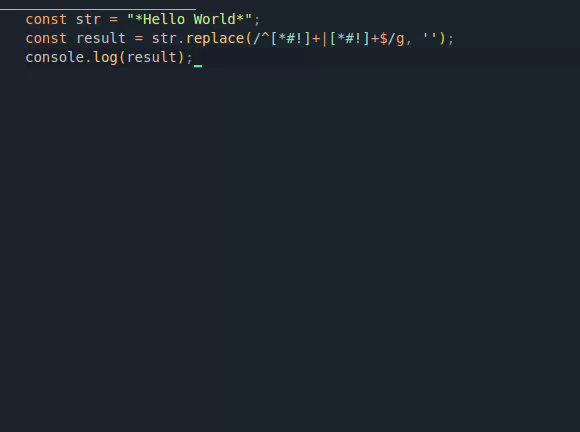

# Inline Commenter

This is the README "inline-commenter". This extension allows you to easily wrap highlighted text with inline comments in your code.

## Features

- **Wrap with Comments**: Quickly wrap selected text with `/* */` for inline comments by pressing .
- **Toggle Comments**: If the selected text is already commented, it will remove the comments.

## Usage

To use the Inline Commenter extension:

- **Highlight the text** you want to comment or uncomment.
- **Press `Ctrl+Shift+/`** (or `Cmd+Shift+/` on macOS) to toggle inline comments.

## Requirements

- [Visual Studio Code](https://code.visualstudio.com/) version 1.62.0 or higher.

## Extension Settings

This extension does not contribute any settings through the `contributes.configuration` extension point.

## Known Issues

- None reported.

## Release Notes

### 0.0.1

- Initial release of Inline Commenter.
